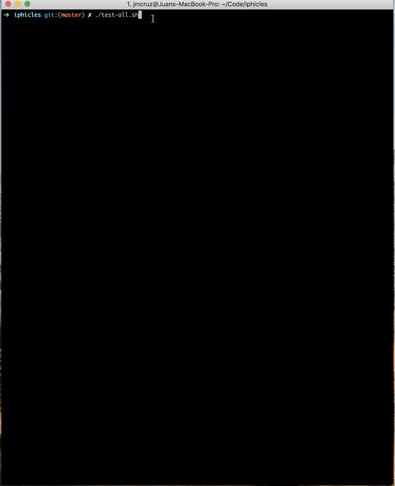

# iphicles


### Table of contents

 1. [What is this](#WHAT_IS_THIS)
 2. [Structure](#STRUCTURE)
 3. [Requirements](#REQUIREMENTS)
 4. [What is tested](#WHAT_IS_TESTED)
 5. [Automation](#AUTOMATION)
 6. [How to run it](#HOW_TO_RUN_IT)
 7. [Observations](#OBSERVATIONS)
 8. [Example of usage](#EXAMPLES_OF_USAGE)

### WHAT_IS_THIS:

Iphicles project aims to give a solution to [heracles](https://github.com/pleo-io/heracles) challenge.
This project combines several technologies and frameworks to achieve the solution.

Solution consists of a backend-frontend application together with regression and acceptance end-to-end test-suite.

### STRUCTURE:

This project has 4 sub-projects with following structure:
``` bash
.
├── back-end
│   └── src
├── front-end
│   ├── e2e
│   └── src
├── images
├── regression-test
│   ├── features
│   └── report
└── ui-test
    ├── config
    └── src
```
##### back-end:

Back-end sevice is a java sprint boot application that offers a rest-full API used by the fronted.

##### front-end:

Front-end application is an angular application that offers simple single page application where money formatting can be done.

##### images:

Images folder contains the different multimedia resource attache in this README file.

* iphicles.png : screenshot of front-end application.
* iphicles_build.gif : recorded screen of running ``./build-all.sh``.
* iphicles_test.gif : recorded screen of running ``./test-all.sh``.

##### regression-test:

Regression test is a tool implemented with Node and CucumberJS that verifies the rest-full API offered by the back-end.

##### ui-test:

UI test is a tool implemented with Groovy, Spock, [Geb](https://gebish.org) and Selenium that performs an acceptance testing by exercising application offered by front-end.

### REQUIREMENTS:

Iphicles requires:
* Mac-OSx
* Docker for Mac [link](https://docs.docker.com/docker-for-mac/install/) (version 2.1.0.5)
* docker-compose [link](https://docs.docker.com/compose/install/) (version 1.24.1)
* Screen sharing (optional and installed by default on Mac) 

##### WHY?

* Project was developed using my personal Mac laptop.
* Docker and VNC viewer require admin privileges to be installed.
* Specific versions for docker and docker-compose are provided in case of error when running with different version. 

### WHAT_IS_TESTED:

##### back-end:

In back-end project following testing is carried:
* Unit testing verifying the API rest controller and service with the logic.
* Contract testing, aka [PACT](https://docs.pact.io), testing the provider side of the API contract. 
* **NOTE** that these tests need to PASS in order to generate a release back-end artifact.

##### front-end:

In front-end project following testing is carried:
* Component testing verifying the different components and services.
* UI testing using protractor that renders and verifies the full UI.
* **NOTE** that these tests need to PASS in order to generate a release front-end artifact.

##### regression-test:

Regression test project is an API testing framework that aims to conduct a full regression testing exercising the rest-full API offered by back-end:
* Full batterry of tests is performed using the [big list of naughty strings](https://github.com/minimaxir/big-list-of-naughty-strings).

##### ui-test:

UI test project is an end-to-end acceptance testing exercising the application offered by front-end using selenium.

### AUTOMATION:

Iphicles is automated using docker-compose that runs docker images built previously and some helper/external tools (like nginx proxy or selenium node).
This cluster is configured to start-up in a predefined order and with health checks to establish order/run dependencies. 
Where regression-test or ui-test specifies their dependencies, spawning the required services needed for the testing.

### HOW_TO_RUN_IT:

Iphicles provides single script to build and run everything. 
So simply executing ``./build-and-test-all.sh`` would fetch docker dependencies and build services, start-up the cluster and finally run the regression and ui testing.
In case of having everything built, executing ``./test-all.sh`` would run testing without using already built services.
Just to build everything, ``build-all.sh`` would re-build all the services and generated the release docker images.

### OBSERVATIONS:

* **BE PATIENT!** first build would take longer as it would need to fetch all the docker dependencies that would be cached for later.
*  When running _ui-test_, screen sharing applicawtion can be used to visualize what it is rendered on the browser. Just executing ``open vnc://localhost:5900`` with password ``secret``.

### EXAMPLES_OF_USAGE:

##### build-all.sh:


##### test-all.sh:

